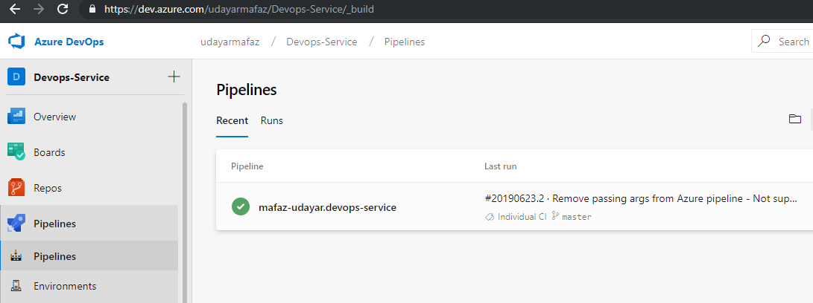
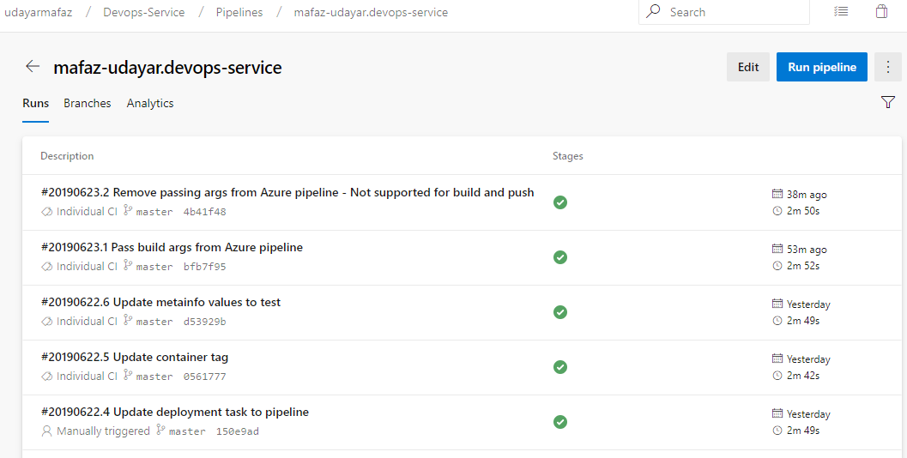
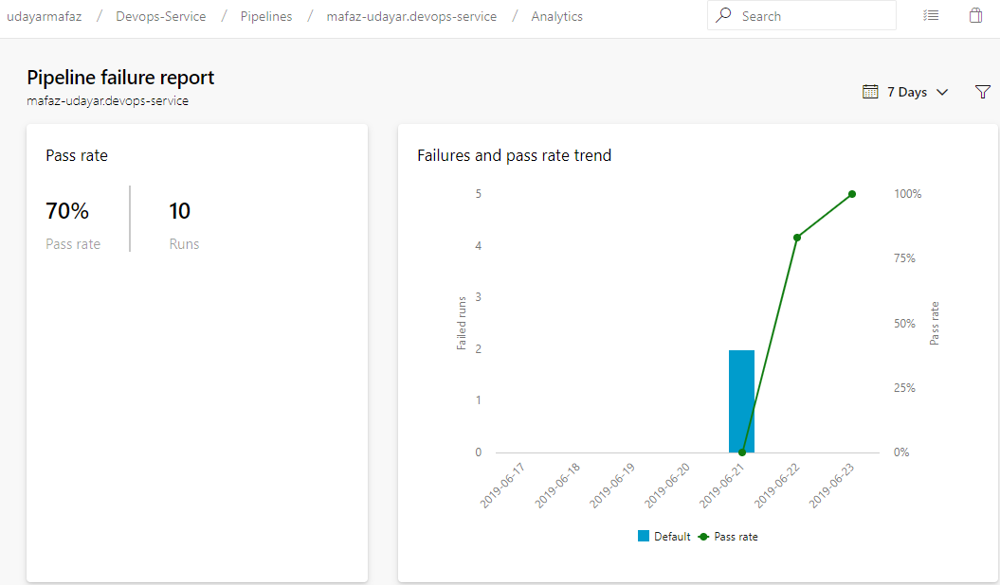
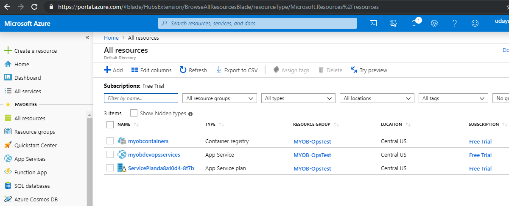
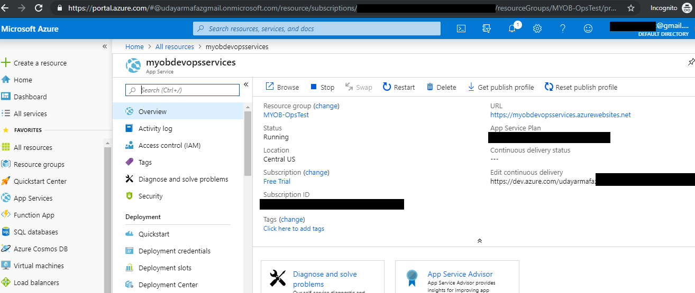

# devops-service
This is a simple dotnet core application that is built in docker and deployed to Azure.

## Application Details

- This application is a dotnet core Web-api built in dotnet core 2.2
- Application uses xunit for unit testing

## Web endpoints

- https://myobdevopsservices.azurewebsites.net/api/myob
- https://myobdevopsservices.azurewebsites.net/api/metainfo
- https://myobdevopsservices.azurewebsites.net/healthz

## Build and packaging

- This application uses docker to build, test and create the dotnet core output files
- It uses docker multistage build to create a smaller docker image as it's production image
- This application does continuous integration and continuous deployment through Azure pipeline

- This application uses pipeline as code approach. The CI/CD steps are defined in a yaml file and checked into the repo.
- The final image is pushed to a private Azure container registry through the pipeline
- Each commit to master branch does a build and deploys the application as a webapp into Azure

